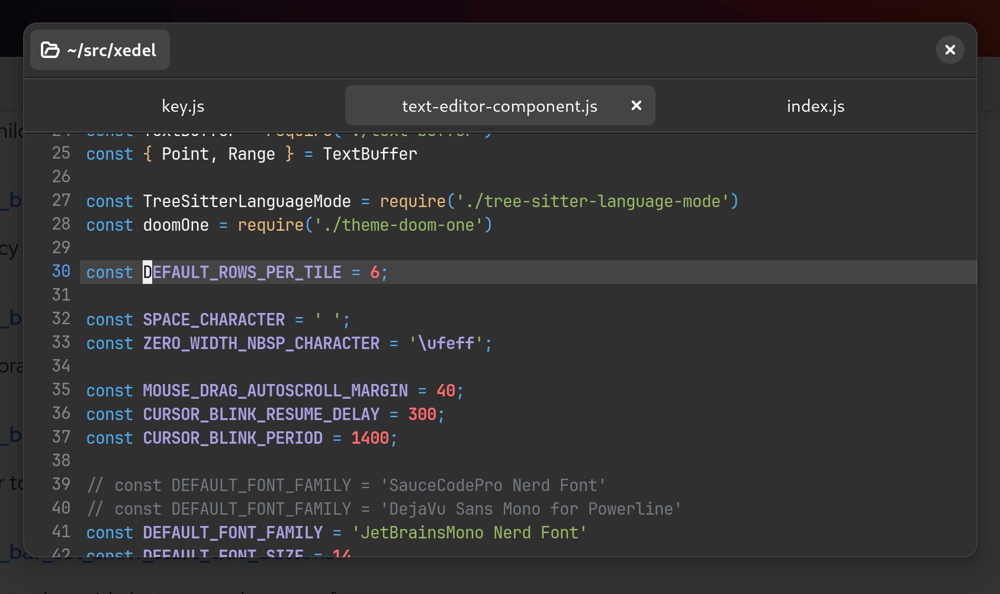

# xedel

The goal of xedel is to be a modern text editor, that would be a spiritual GUI successor to neovim.
I should note that this is currently very hypothetical, the core part of the editor is mostly
working but there is still a lot of work to do to get it to a competitive point.

### Goals
 - Keyboard-centric, inspired from vim, kakoune, spacemacs
 - GUI, using native technologies (not electron)
 - Batteries-included, as in VSCode-equivalent
 - Extendable, using a decent scripting language

  

### Current technological choices
 - Node.js
 - GTK+ via node-gtk
 - tree-sitter via node-tree-sitter
 - Atom core

While both Gtk+ and tree-sitter are usable from Rust, which could be an interesting language choice, I've chosen to
start with javascript because Javascript offers a faster feedback loop. Besides, critical parts of the editor can be
implemented in C/C++ or Rust with native modules.

Using node.js also provides a non-blocking model by default, being based on an event-loop at its
core. It also makes it easy to create a plugin system where authors can use Javascript, which is
the closest thing we have to a programming *lingua franca* (and I hate python a lot).

Finally, to save time, I've decided to use as a base the now deprecated Atom editor.

### Features

 - [x] Editor: rendering
 - [x] Editor: marks & decorations
 - [x] Editor: multi-cursor
 - [x] Editor: API
 - [x] Syntax (tree-sitter) (in progress)
 - [x] Core: keyboard-mapping system (in progress)
 - [x] Plugin system
 - [ ] Autocomplete & LSP
 - [ ] UI (side panels, grid view, tabs)
 - [ ] Fuzzy-finder
 - [ ] File searching/replacing
 - [ ] Language Server Protocol
 - [ ] Debug Adapter Protocol

### Current thoughts

#### The good parts

I got stuff working much more easily than I thought. Replacing the DOM with Gtk was quite pleasant. Re-using Atom also
means we got a lot of features for free, such as the package system, the editor component, the modal editing, syntax
highlighting.

#### The bad parts

I'm not sure if it will cause any problems, but `node-gtk` is my toy project. It's not bad, but it has received much
less love than `gjs`.

The editor component scrolling feels slow because it's not performant enough. Ideally the core components such as that
one would be written in a native language, but I really just did a 1-1 replacement of the DOM implementation, so it uses
a tiling system that doesn't work really well. This isn't a permanent blocker though, it can be optimized or replaced by
native code where/when appropriate.

### Why did X fail.../Why not...

#### onivim

Very talented developer, but the lack of resources combined with the technological choices made this project unlikely
to succeed. Trying to develop a UI framework from scratch for a language with low adoption is a big task. The choice
to preserve vim as the underlying engine also meant that the project was preserving vim's limitations, such as
the impossible multi-cursors or the terrible plugin language.

#### lapce

Similar to the above, trying to use an experimental & still WIP UI framework means the editor doesn't have a polished
look. It also diverts resources from implementing the core editor logic, which is modal editing.

#### xi

Very cool in theory, but in practice the model doesn't work. It has the same limitations as neovim GUIs: keypress
latency is higher than it needs to, and the required IPC between the core & the frontend makes it hard to have a good
execution/implementation of the features. A code editor isn't just an abstract backend model; it's a very tangible
interface that users need to intuitively understand very deeply. Loose coupling is a good principle in general, but in
this particular case it doesn't work.

#### atom

Even early in the vscode vs atom war, it was very clear that vscode was going to win (and I say this as an early atom
fanboy). They got a lot of stuff right (this project is based on atom!), but they left too many details to external
plugins. Why was it necessary to install `autocomplete-plus`? The code editor should have the best possible autocomplete
implementation to start with. A strong core & an unified vision is necessary. Plugins should be there for edge cases.

#### vscode

I love vscode so much, if I could I would be using it. They have a great execution, great vision, they understand
precisely what developers need. The only missing detail is that they haven't made modal editing a central tennet of the
editor. And they have decided that all plugins must run in separated processes, which although good in theory, means
that plugins with high latency requirements (aka vim mode, which runs on each keypress) have an unacceptable feel.

#### gnome-builder

Also a very talented developper, fantastic editor with a fantastic look. The main issue is that it's written in C with
Gnome conventions, which means it's not very well documented and it's hard to extend. I know they have GJS plugins
coming up soon, but I'm not sure how easy it will be to work with. Also the vim mode sucks. Also they re-use (or extend?)
the GtkSourceView component, which although good, is not great. And a code editor's editor component is one of its
make-or-break features. I've been shamelessly copying their theme/style though.

### License

MIT

The editing code (in `src/editor`) has been mostly extracted from
[Atom](https://github.com/atom/atom), also licensed under MIT.
